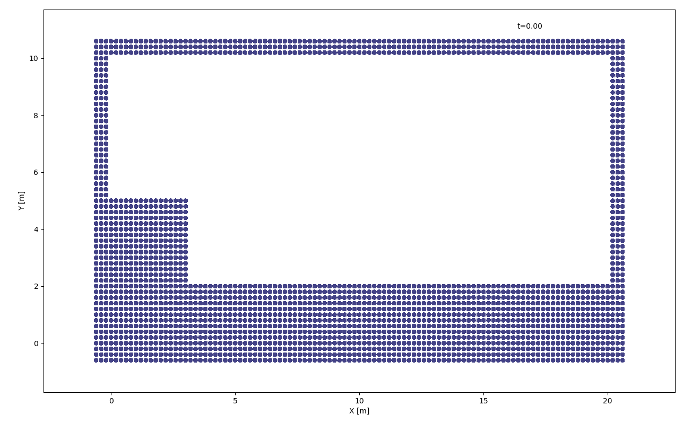
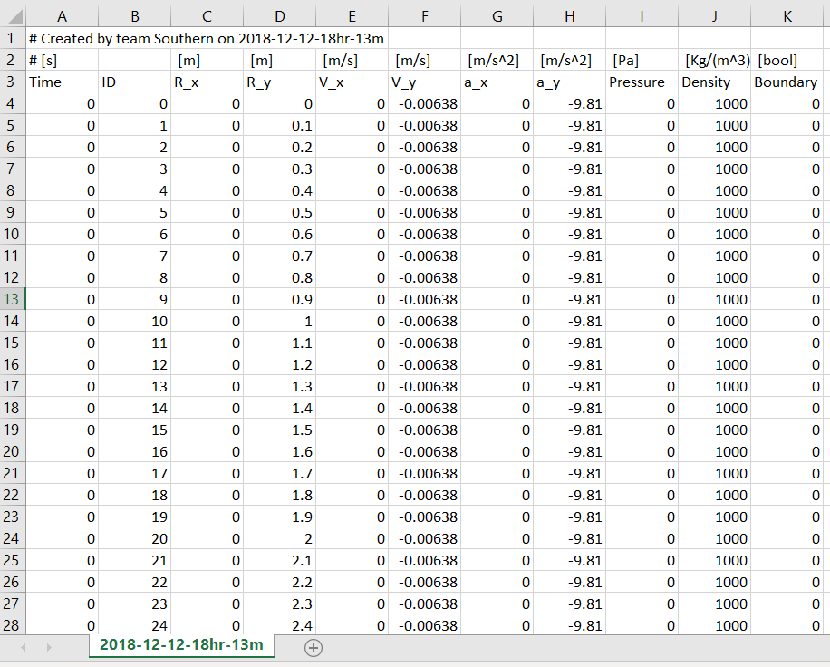
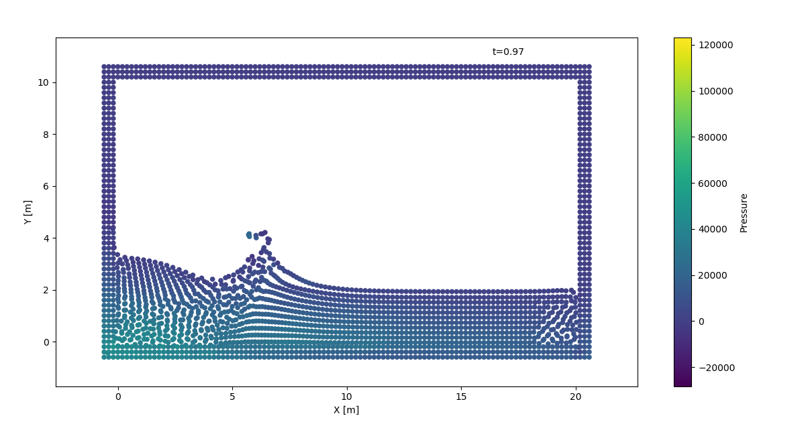

Smoothed Particle Hydrodynamics Simulator
===========================================
Creators: Richard Boyne, Deborah Pelacani Cruz, Deirdrée Polak, Tayfun Karaderi, Yusef Falola

This software is designed to simulate a 2D fluid flow system using a space and time discretisation of the Navier-Stokes and conservation of momentum equations. System boundaries are implemented using the Lennard-Jones Potential for repulsion to prevent particles from leaking. Timestepping is adaptive to guarantee CFL stability.

Please, read License agreement prior using.

## Installation
The software should be used as python modules in your local folder. In your python project import the modules as:
      
```python
import sph_fe as sphfe
import sph_ie as sphie
import sph_ap as sphap
```

## Requirements
To be able to run this software, the following packages and versions are required:

- numpy >= 1.15.4
- scipy >= 1.1.0
- matplotlib >= 3.0.2
- mpltools >= 0.2.0
- sympy >= 1.3
- pandas >= 0.23.4

## Documentation
*For full documentation see documentation_html*
```python  
def sph_simulation(x_min, x_max, t_final, dx, func, path_name='./', ani=True,
                   **kwargs):
    """
    Simulates fluid flow from user-specified initial state and timeframe using
    smoothed particle huydrodramics method.
    
    Parameters
    ----------
    x_min : list-like
        List with [x,y] coordinates of bottom left boundary, assumed rectangular
    x_max : list-like
        List with [x,y] coordinates of upper right boundary, assumed rectangular
    t_final : float
        Timeframe of simulation.
    dx : float 
        Initial distance between particles in domain. Particles assumed to be
        equally spaced on domain specified by func
    func : function 
        A function that specifies the initial distribution of particles in the
        domain with a boolean output.
    path name : string
        Path where files are to be saved.
    ani : boolean 
        "True" if animation is to be displayed and "False" if otherwise.

    Other Parameters
    ----------------
    ani_step: int
        frame skipping
    ani_key: string
        header for colorplot. Choose beteween: ID, Pressure, Density, V_x, and V_y
    h_fac : float -- set attribute
        bin half size constant (unitless).
    mu : float -- set attribute
        viscosity (Pa s) [Deafult value = 0.001]
    rho0 : integer -- set attribute
        initial particle density (kg/m^3). [Deafult value = 1000]
    c0 : integer -- set attribute
        fit-for-purpose speed of sound in water (m/s). [Deafult value = 20]
    gamma : constant -- set attribute
        stiffness value (unitless). [Deafult value = 7]
    interval_smooth : integer -- set attribute
        number of timesteps to which smooth rho (unitless). [Deafult value = 15]
    interval_save : integer -- set attribute
        number of timesteps at which the current states are saved (unitless).
        [Deafult value = 15]
    CFL : float -- set attribute
        Scale factor for Courant–Friedrichs–Lewy condition (unitless). [Deafult value = 0.2]
    g : 1D array -- set attribute
        body force based 2D vector [gravity value (m/s^2)]. [Deafult value = [0, -9.81] ]
    tf : float
        Total real time to run simulation.
    P_ref : float (only in the Forward Euler Module)
        Boundary reference pressure to prevent leakages (Pa).
    d_ref : float (only in the Forward Euler Module)
        Reference distance for enforcing boundary pressure (m).
    file_name : string
        Name of file to be saved. If None saves with current time[Default = None]
    
    """

def load_and_set(file_name, ani_key='V_x'):
    """
    Function to load a file and set animation class instances. To run animation
    call animate() method on returned object.

    Parameters
    ----------
    file_name: string
        name of the file to load. Should be generated by sph_simulate()
    ani_key: string
        header for colorplot. Choose beteween: ID, Pressure, Density, V_x, and V_y
    
    Returns
    -------
    ani: class object
        From the instance of animate
    """
    
def animate(self, ani_step=1):
  """
  Animates a class object creared by load_and_set() function

  Parameters
  ---------
  ani_step: int
      frame skipping
  """
```

## Usage
The three modules provide different methods and adaptations to timestepping the Navier-Stokes equations. 
- sph_fe: provides a forward euler timestepping, with Lennard-Jones boundary repulsion (optimised)
- sph_ie: provides an improved predictor-corrector timestepping method with Lennard-Jones boundary repulsion
- sph_ap: provides the same predictor-corrector timestepping method, with Lennard-Jones boundary repulsion and inserted artificial pressure to prevent tensile instability.

The table below summarizes their functionality:

|              |Forward Euler| Predictor-Corrector| Find Neighbour Opt| Artificial Pressure| LJ Boundary Forces | Leak Control| Front End |
|-------------| -------------------| ------------------| -------------------| -------------------| ------------| --------- |-------
| `sph_fe`    |         ✔          | | ✔| | ✔| ✔| ✔|
| `sph_ie`| | ✔| | | ✔| ✔| ✔|
| `sph_ap`| | ✔| |✔ | ✔| ✔| ✔|


The simulation can be easily run using the sph_simulation function, common amongst all modules. The simulator requires the user to specifcy a minimum and maximum coordinate (in meters) of the system domain, a time frame (in seconds) and a function that specifies the initial position of particles of the domain with a boolean output. Other parameters are optional and if not specified will be used as the default setting (refer to docstring).

### Example 1
```python    
def f(x, y):
        if 0 <= y <= 2 or (0 <= x <= 3 and 0 <= y <= 5):
            return 1
        else:
            return 0

sphfe.sph_simulation(x_min=[0, 0], x_max=[20, 10], t_final=1, dx=0.2, func=f, path_name='./examples/',
                     ani_step=10, ani_key="Pressure", file_name="example33")
```
The function *f* will produce the following initial condition:



and the simulation will produce a .csv file at the specified path name and file name containing information about each particle at each timestep in the following format:



Unless the optional parameter *ani* is set to False, the simulator function will also produce an animation of the dynamic system over the timeframe. The parameter *ani_key* will let you choose between what parameters should be plotted in the colorplot besides position of the particles. Choices are: Pressure, Density, V_y and V_x. Parameter *ani_step* allows for quicker plotting by skipping some of the timestepping frames.



### Example 2
If a file with the format above already exists, a simulation can be animated simply by setting up and calling the animation function
```python
ani = sphfe.load_and_set('./examples/example33.csv', 'Density')
ani.sphfe.animate(ani_step=10)
plt.show()

```
 See *figs* and *examples* folder for examples of animations.
